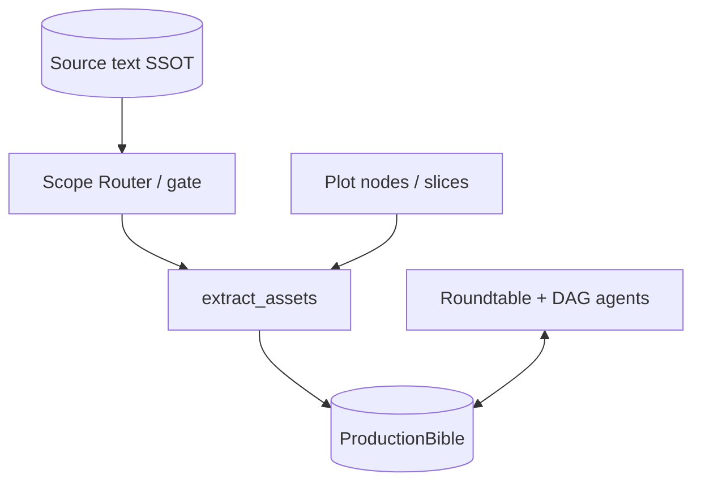

# 🎬 Backlot Alpha | AI Film Production Server

> **"AI handles the sweat, you handle the inspiration."**

**Backlot Alpha** targets original literary IP and serial storytelling: **multi-agent roles** (studio-style crew) fold raw text into a **`ProductionBible` (SSOT)**, then advance through script, storyboard, art, and camera steps toward **storyboard frames and Veo video** (optional). The **goal** is more controllable **script-to-screen** behavior under explicit production semantics; **shot-level continuity and the default full render path** are still evolving — quality and rollback policy: **[docs/plans/HANDBOOK_LAYERED.md](../docs/plans/HANDBOOK_LAYERED.md)** (CN) / **[HANDBOOK_LAYERED_EN.md](../docs/plans/HANDBOOK_LAYERED_EN.md)** (EN overview).

**v5.1** — full crew **Tool-Augmented Roundtable**: produce agents share a base class and Function Calling tools; fixes flow through roundtable **FEEDBACK** and human **DIRECTIVE**, not self-eval loops. **v5.0** — Redis Pub/Sub roundtable; **CONSENSUS_REACHED** triggers AAV ingest and Veo paths. **v4.1** — writer feedback loop, acting-coach set language, cinematographer four-way fusion + VLS. **v4.0** — DAG workflow engine and `/api/v1/workflow`.

**Track B** (long-form / matrix, shipped alongside v5.x): **source-text SSOT**, `scope_router`, pre-Analyst gate, **plot slice library** and **plot nodes** (human selection → `bible-from-plot-nodes`), optional **`bible_aav_bridge`** into AAV. Index: **[docs/plans/README.md](../docs/plans/README.md)**.

### Data flow (Bible-centric)



---

## 📈 Version evolution

### v1.0: Foundation — Story to visual assets
- Analyst, Art Director, Production Bible, FastAPI

### v2.0: Dual-brain
- Left: Analyst + Art | Right: Playwright + Director
- Physics-first writing, continuity logic, Veo-oriented prompts

### v3.0: Quality assurance
- Bible Auditor, Literary Critic, Visual Logic Supervisor
- Services layer (LLM, Image, Video, Multimodal), modular schemas

### v4.0: DAG workflow engine
- `BaseNode`, DAG executor, `/api/v1/workflow` (registry, templates, execute, SSE progress)

### v4.1: Core pipeline optimization
- Writer feedback loop, acting-coach on-set language, cinematographer + VLS, storyboard retry/safety

### v5.0: Roundtable engine (Pub/Sub)
- Redis bus, typed events, Art/Cinematographer listeners, CONSENSUS_REACHED execution

### v5.1: Tool-Augmented Roundtable ⭐ **Current**
- **Base class**: `BaseToolAugmentedAgent`; `handle_roundtable_event` + `generate_content_with_tools`
- **No self-eval rerun loops** on core steps; FEEDBACK + DIRECTIVE instead
- **LLM routing**: `AGENT_PROVIDER_MAP` — roundtable **Claude** for most roles; **ArtDirector** roundtable keeps **Gemini** (same path as `trigger_draft_render`). PM tools still call `produce_storyboards` (images + Veo).
- **Seven tool-enabled agents**: Analyst (`initialize_bible_from_novel`, **`initialize_bible_from_plot_slices`**, **`initialize_bible_from_plot_nodes`**, same as HTTP), Playwright (`update_scene_beats`), ActingCoach, Cinematographer (`update_shot_camera_and_vls`, `preview_veo_prompt`, PULL_BACK rule), Director (`override_bible_state`, `approve_for_render`), ProductionManager (`trigger_veo_render_pipeline`), ArtDirector (`update_bible_attribute`, `trigger_draft_render`); **delegate_to_specialist** for handoff
- **Bible SSOT**: `bible_state.py`; optional SYSTEM_LOG to refresh DAG
- **Executor**: `approve_for_render` → Veo pipeline
- Details: [docs/V51_TOOL_AUGMENTED_ROUNDTABLE.md](docs/V51_TOOL_AUGMENTED_ROUNDTABLE.md), [docs/ROUNDTABLE_V5.md](docs/ROUNDTABLE_V5.md)

---

## 🏗️ Architecture

| Agent | Role | Roundtable tools (v5.1) |
|-------|------|-------------------------|
| **ScriptAnalyst** | First contact; raw text / SSOT / selected slices or nodes → Bible | `initialize_bible_from_novel`, `initialize_bible_from_plot_slices`, `initialize_bible_from_plot_nodes` |
| **Playwright** | Script + three-act beats | `update_scene_beats` |
| **Director** | Shot design; approve render | `override_bible_state`, `approve_for_render` |
| **Acting Coach** | Subtext + micro-physical cues | `update_shot_acting_cues` |
| **Art Director** | Look dev, 4K assets | `update_bible_attribute`, `trigger_draft_render` |
| **Cinematographer** | Four-way fusion + VLS | `update_shot_camera_and_vls`, `preview_veo_prompt` |
| **Production Manager** | Storyboards + Veo packaging | `trigger_veo_render_pipeline` |
| **Roundtable** | PROPOSE → FEEDBACK (tools) → CONSENSUS → Executor (AAV / Veo) | — |

Evaluate agents (BibleAuditor, etc.) remain optional reports; they do not block the main loop.

- Workflow: [docs/WORKFLOW.md](docs/WORKFLOW.md)  
- Roundtable: [docs/ROUNDTABLE_V5.md](docs/ROUNDTABLE_V5.md)  
- v5.1 tools: [docs/V51_TOOL_AUGMENTED_ROUNDTABLE.md](docs/V51_TOOL_AUGMENTED_ROUNDTABLE.md)  
- Long-form / matrix / Appendix F: [../docs/plans/HANDBOOK_LAYERED.md](../docs/plans/HANDBOOK_LAYERED.md) · [../docs/plans/HANDBOOK_LAYERED_EN.md](../docs/plans/HANDBOOK_LAYERED_EN.md)

---

## 🛠️ Stack

- **Server**: FastAPI (Python)
- **LLMs**: **Gemini** (`LLMService`) for execution paths; **Claude** for most roundtable roles — see `AGENT_PROVIDER_MAP`
- **Images**: Gemini 3 Pro Image via ImageService  
- **Video**: Google Veo 3.1 via VideoService  
- **Vision**: Gemini 3 Pro Vision via MultimodalService  
- **Storage**: Local `outputs/` (storyboards, videos, analysis, `{id}_source` SSOT, …)  
- **Roundtable**: Redis Pub/Sub (`REDIS_URL`); Docker often uses `redis://redis:6379/0`

---

## 📁 Layout

```
backlot_alpha/
├── app/
│   ├── agents/
│   ├── core/            # DAG
│   ├── nodes/
│   ├── routers/         # workflow_v1, roundtable_v1, conversation_v1, source_text_v1
│   ├── roundtable/
│   ├── services/        # bible_state, novel_decomposition, bible_aav_bridge, …
│   ├── schemas/
│   └── main.py
├── scripts/
├── docs/
└── outputs/
```

---

## 🚀 Quick start

1. **Dependencies**

```bash
cd backlot_alpha
pip install -r requirements.txt
# Load env from repo root .env (e.g. GOOGLE_API_KEY)
```

2. **Run**

```bash
uvicorn app.main:app --reload --port 8001
# Default without --port is 8000 → http://127.0.0.1:8000/docs
```

3. **Pilot E2E**

```bash
python scripts/run_pilot_episode.py --input data/chapter_01.txt
```

4. **APIs**
- Step API: `/production/analyze`, … → `/production/{id}/shoot_scene`
- DAG: `GET /api/v1/workflow/templates/default`, `POST /api/v1/workflow/execute`
- Roundtable: `/api/v1/roundtable/status`, `propose`, `directive`, `consensus`, **SSE** `GET /api/v1/roundtable/stream` (needs `REDIS_URL`)
- Source text / matrix: `/api/v1/source-text/...` — see **[../docs/plans/HANDBOOK_LAYERED.md](../docs/plans/HANDBOOK_LAYERED.md)** Appendix E

5. **E2E scripts**
- **Roundtable v5.1**: `python scripts/run_e2e_roundtable_v51.py` (needs Redis + daemon)
- **DAG fallback**: `python scripts/run_e2e_workflow_dag.py`  
Default `--base-url http://127.0.0.1:8001` for Docker-mapped port.

### Docker

See root [README.md](../README.md#docker-compose-stack).

---

## 🔗 Aegis Asset Vault (AAV)

1. **Resolve** — `POST /api/v1/assets/resolve` for assembled prompts and presigned refs.  
2. **Art ingest** — `aav_client.ingest_*` after renders.  
3. **Bible → AAV (thin bridge)** — [app/services/bible_aav_bridge.py](app/services/bible_aav_bridge.py): `sync_bible_to_aav`; HTTP **`POST /api/v1/source-text/{production_id}/aav-sync-bible`**; optional **`BACKLOT_AAV_SYNC_AFTER_PLOT_NODES`**, **`BACKLOT_AAV_SYNC_PROFILE`**.

AAV lives in repo **`aegis_asset_vault/`**.

---

## 📄 License

MIT License. Backlot Studio.
