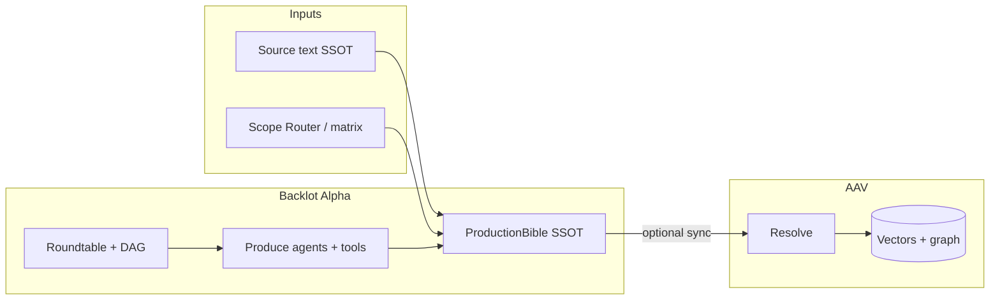
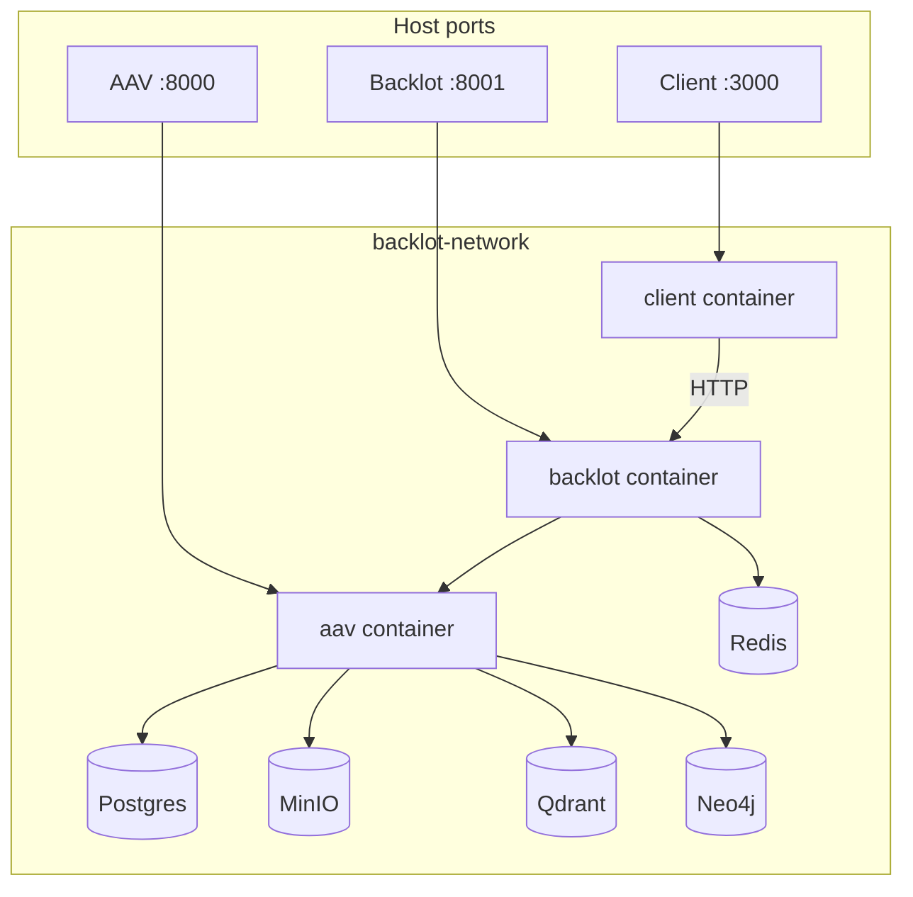

# Backlot Film Maker

An **AI-assisted film production toolchain** centered on the **`ProductionBible` as the production SSOT**, with **multi-role agents** and a **DAG / roundtable tool chain** from text to assets and shots, plus **Aegis Asset Vault (AAV)** for Resolve and structured asset ingest to improve consistency of characters, environments, and props across shots.

**In scope today**: long-form / IP cold start (**source-text SSOT**, **Scope Router**, plot slices and **human-in-the-loop plot nodes** → `extract_assets` into the Bible), Tool-Augmented roundtable collaboration, optional Veo renders and storyboard pipelines. **Still evolving**: shot-level continuity, stability of the default render path, and Appendix D–style quality gates — see [docs/plans/HANDBOOK_LAYERED.md](docs/plans/HANDBOOK_LAYERED.md) (Chinese; [English overview](docs/plans/HANDBOOK_LAYERED_EN.md)).

### Architecture (high level)



---

## Subprojects

| Project | Path | Description |
|---------|------|-------------|
| **Backlot Alpha** | [backlot_alpha/](backlot_alpha/) | Multi-agent pipeline (Analyst → Art → Playwright → Director → ActingCoach → VLS → Cinematographer → PM), **DAG** (`/api/v1/workflow`), **V5.1 roundtable** (Redis + 7 tool-enabled agents); **REST** `/api/v1/source-text/...` (SSOT, matrix gate, slices / plot nodes, `bible-from-plot-nodes`, **`aav-sync-bible`**), `/api/v1/conversation/...`. |
| **Backlot Alpha Client** | [client/](client/) | Dual-pane UI: Writers' Room × Factory Floor × Inspector; roundtable propose/consensus; **long-text cold-start panel** (with `source-text` APIs); approve-for-render. |
| **Aegis Asset Vault (AAV)** | [aegis_asset_vault/](aegis_asset_vault/) | Visual-consistency microservice: **Resolve**, prop vectors (Qdrant), continuity graph (Neo4j), MinIO/PostgreSQL; Backlot can ingest via **Art renders** or **`bible_aav_bridge`** (**structured Bible → AAV without reference images**, as a Resolve prerequisite). |

- **Backlot Alpha** (versions, architecture, agents, quick start) → **[backlot_alpha/README.md](backlot_alpha/README.md)**  
- **Decomposition / matrix / SSOT / progress (Appendix F)** → **[docs/plans/README.md](docs/plans/README.md)** · **CN:** [HANDBOOK_LAYERED.md](docs/plans/HANDBOOK_LAYERED.md) · **EN overview:** [HANDBOOK_LAYERED_EN.md](docs/plans/HANDBOOK_LAYERED_EN.md)  
- **Workflow & agent roles** (Mermaid, prompts) → **[backlot_alpha/docs/WORKFLOW.md](backlot_alpha/docs/WORKFLOW.md)**  
- **AAV install / Docker / API / tests** → **[aegis_asset_vault/README.md](aegis_asset_vault/README.md)**

**Diagrams in this repo** use [Mermaid](https://mermaid.js.org/). In VS Code, install the recommended **Markdown + Mermaid** extension (see [.vscode/extensions.json](.vscode/extensions.json)) for preview.

---

## Quick start

```bash
# Backlot Alpha API (use --port 8001 to match the port table below)
cd backlot_alpha && uvicorn app.main:app --reload --port 8001

# Aegis Asset Vault (optional)
cd aegis_asset_vault && uvicorn aegis_asset_vault.api.main:app --reload --port 8000
```

More commands and env vars: per-subproject READMEs. **Docker + AAV test walkthrough**: [README_START_AND_TEST.md](README_START_AND_TEST.md).

---

## Docker Compose stack

The repo root **`docker-compose.yml`** runs **Backlot Alpha Client**, Backlot Alpha, Aegis Asset Vault, **Redis** (roundtable bus), Postgres, MinIO, Qdrant, and Neo4j on bridge network **`backlot-network`**. Backlot waits for AAV health; Client waits for Backlot. **Environment**: AAV and Backlot read the **repo root `.env`** (`env_file: .env` in Compose). Configure `GOOGLE_API_KEY` etc. there; `REDIS_URL` is injected for Backlot and the roundtable daemon starts automatically.

```bash
# From repo root (with .env present):
docker compose up -d --build
```

### Service topology



### Ports (no collisions on defaults)

| Service | Host port | Container port | Notes |
|---------|-----------|----------------|-------|
| **Backlot Alpha Client** | 3000 | 80 | Open http://localhost:3000; API calls go to 127.0.0.1:8001 |
| **Backlot Alpha** | 8001 | 8000 | API, Swagger `/docs`, `/api/v1/roundtable`, `/api/v1/source-text/...` |
| **AAV** | 8000 | 8000 | Asset + Resolve API |
| **Redis** | 6379 | 6379 | Roundtable Pub/Sub |
| **MinIO API** | 9000 | 9000 | S3 / presigned URLs |
| **MinIO Console** | 9001 | 9001 | Web UI |
| **PostgreSQL** | 5432 | 5432 | AAV primary store |
| **Qdrant** | 6333, 6334 | 6333, 6334 | Vectors |
| **Neo4j** | 7474, 7687 | 7474, 7687 | HTTP / Bolt |

- **Frontend**: after `docker compose up -d --build`, use **http://localhost:3000** (Writers' Room × Factory Floor).  
- **In-container AAV URL**: `AAV_BASE_URL=http://aav:8000` (injected); do not use `localhost` from inside Backlot.  
- **Hot reload**: uncomment `command` / `volumes` for the backlot service in Compose to mount code and `--reload`.

---

## Repository layout

```
Backlot-Film-Maker/
├── README.md                 # This file
├── docker-compose.yml
├── .env
├── docs/plans/               # Matrix, layered handbook (CN), EN overview, Appendix F progress
├── client/
├── backlot_alpha/
└── aegis_asset_vault/
```

---

## License

MIT License. Backlot Studio.
