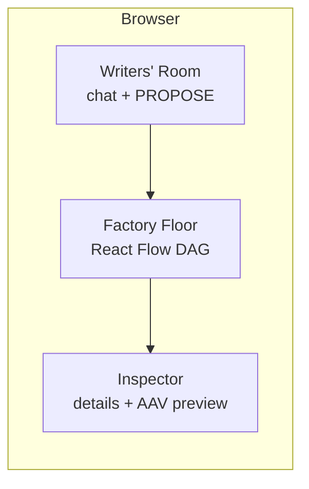

# Backlot Alpha Client

Dual-track **Chat-to-DAG** UI: **Writers' Room** × **Factory Floor** × **Inspector**.  
Aligned with [FRONTEND_HANDBOOK.md](../FRONTEND_HANDBOOK.md) and the Backlot API.

### UI layout



---

## Stack

- **React 18+** (Vite)
- **React Flow** (`@xyflow/react`) — DAG canvas
- **Zustand** — Bible / graph / chat / selection
- **Axios** — REST (propose, consensus, bible, workflow, **source-text / plot workflow**)
- **SSE** — `GET /api/v1/roundtable/stream` (subscribe by `session_id` for system events, e.g. asset-generated)

---

## Local dev

```bash
npm install
npm run dev
```

---

## Docker (full stack)

From repo root:

```bash
docker compose up -d --build
```

- App: **http://localhost:3000**  
- Backlot API: **http://127.0.0.1:8001**

Rebuild client only:

```bash
docker compose build client && docker compose up -d client
```

**API base URL** (default `http://127.0.0.1:8001`):

```env
# .env.local
VITE_BACKLOT_API=http://127.0.0.1:8001
```

---

## Regions

| Region | Role |
|--------|------|
| **Left** | Writers' Room — PROPOSE, FEEDBACK, SYSTEM_LOG |
| **Center** | Factory Floor — React Flow (Script / Asset / Veo nodes) |
| **Right** | Inspector — selection details, AAV preview |

---

## Current capabilities

- **Roundtable + DAG**: `propose` / `consensus`, `GET /production/{id}`, workflow templates + execute.
- **Long-text cold start**: `LongTextColdStartPanel` + `src/api/sourceTextPlotWorkflow.ts` (SSOT, workflow prefs, plot-node jobs, selection, `bible-from-plot-nodes`, …). Guide: [docs/plans/frontend_cold_start_handbook.md](../docs/plans/frontend_cold_start_handbook.md).
- **Asset preview**: nodes may use `data.imageUrl` / `data.presigned_url` (MinIO presigned; CORS or proxy as needed).

---

## Approve for render

Floating **🎬 Approve for Render**: `POST /api/v1/roundtable/consensus` with `{ "action": "approve_for_render", "session_id": "..." }`.

---

## Backend endpoints

| Purpose | Endpoint |
|---------|----------|
| Chat | `POST /api/v1/roundtable/propose` |
| SSE | `GET /api/v1/roundtable/stream?session_id=...` |
| Bible | `GET /production/{production_id}` |
| DAG template | `GET /api/v1/workflow/templates/default` |
| Run DAG | `POST /api/v1/workflow/execute` |
| Long-form / SSOT / plot nodes | `/api/v1/source-text/{production_id}/...` (see `sourceTextPlotWorkflow.ts`) |
| Optional Bible→AAV | `POST .../aav-sync-bible` |

More: [FRONTEND_HANDBOOK.md](../FRONTEND_HANDBOOK.md).

---

## Diagrams

[Mermaid](https://mermaid.js.org/) in docs; use the VS Code extension recommended in the repo [`.vscode/extensions.json`](../.vscode/extensions.json) for Markdown preview.
